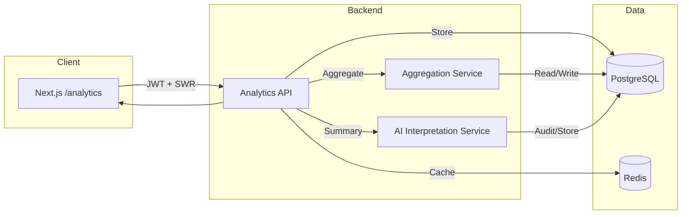

# Analytics & Interpretation Page Architecture

## Overview
This document defines a scalable, high-precision architecture for the **Analytics and Interpretation** page. The design supports Bhrigu Samhita principle processing (karmic epochs/weights), Nadi Jotisha mappings with **Lahiri ayanamsha**, high concurrency, offline caching, and AI-generated interpretive summaries.

## Goals
- **Precision-first** computations referencing manuscript folios (e.g., *Bikaner folio 12b* for Moon elements).
- **Scalable** data retrieval and analytics for 1000+ concurrent users.
- **Reliable** cached responses for offline access.
- **Modular** microservices for aggregation and AI interpretation.

## High-Level Architecture

### Core Services
- **Analytics API (FastAPI/AIOHTTP)**
  - `/analytics` endpoint
  - Orchestrates karmic analytics, Nadi alignment computations, and response assembly.
  - Uses Redis for caching hot predictions and offline sync payloads.
- **Aggregation Service (FastAPI/AIOHTTP)**
  - Aggregates prior predictions, session analytics, and longitudinal insights.
- **AI Interpretation Service**
  - Generates Samhita-aligned summaries using Sarvam/OpenAI.
  - Receives verified computation outputs only (no approximations).

### Data Stores
- **PostgreSQL**
  - Stores analytics payloads, folio references, user profiles, and prediction results.
- **Redis**
  - Prediction caching keyed by (user_id, birth_hash, version).
  - Offline cache payloads for the `/analytics` page.

## Data Flow
1. Client hits `GET /analytics` with auth token and (optional) recalculation flags.
2. Analytics API:
   - Loads user profile.
   - Fetches Nadi planetary positions (Lahiri ayanamsha).
   - Computes karmic weights from `bhrigu_data.py` Samhita principles.
   - Merges with aggregation insights and AI interpretation.
3. Responses are cached in Redis for **<2s** response time.
4. Client uses SWR for background refresh while serving cached data.

## Key Computation Requirements
- **Nadi Alignments:** Deterministic birth chart calculations using Lahiri ayanamsha.
- **Samhita Weighting:** Principle weights must include manuscript folio metadata, e.g., `Bikaner-12b` for Moon elements.
- **No approximations** beyond validated astronomical formulas.

## API Schema (OpenAPI-Style)

### `GET /analytics`

**Query params**
- `birthDate` (string, ISO-8601) – required
- `birthTime` (string, HH:mm:ss) – required
- `birthLocation` (string) – required
- `recompute` (boolean, default=false)

**Response 200**
```json
{
  "user": {
    "id": "uuid",
    "name": "string"
  },
  "samhita": {
    "karmicEpochs": [
      {
        "epoch": "Satya",
        "weight": 0.32,
        "folio": "Bikaner-12b"
      }
    ],
    "principles": [
      {
        "id": "PRN-102",
        "weight": 0.08,
        "folio": "Bikaner-12b",
        "description": "Moon element influences..."
      }
    ]
  },
  "nadi": {
    "ayanamsha": "Lahiri",
    "planetaryAlignments": [
      {
        "planet": "Moon",
        "longitude": 123.456,
        "nakshatra": "Rohini",
        "pada": 2
      }
    ],
    "transitOverlays": [
      {
        "planet": "Jupiter",
        "date": "2025-04-02",
        "influence": "expansion"
      }
    ]
  },
  "predictions": {
    "summary": "string",
    "confidence": 0.91
  },
  "meta": {
    "computedAt": "2025-01-01T12:00:00Z",
    "cacheHit": true,
    "version": "analytics-v1"
  }
}
```

### `POST /analytics/recompute`
Triggers explicit recomputation (rate-limited).

**Body**
```json
{
  "birthDate": "1989-01-01",
  "birthTime": "12:45:00",
  "birthLocation": "Delhi, IN"
}
```

## Database Schema (PostgreSQL)

```sql
CREATE TABLE analytics_profiles (
  id UUID PRIMARY KEY,
  user_id UUID NOT NULL,
  birth_date DATE NOT NULL,
  birth_time TIME NOT NULL,
  birth_location TEXT NOT NULL,
  birth_hash TEXT NOT NULL,
  created_at TIMESTAMP NOT NULL DEFAULT NOW()
);

CREATE TABLE analytics_results (
  id UUID PRIMARY KEY,
  user_id UUID NOT NULL,
  birth_hash TEXT NOT NULL,
  ayanamsha TEXT NOT NULL,
  computation_version TEXT NOT NULL,
  payload JSONB NOT NULL,
  computed_at TIMESTAMP NOT NULL DEFAULT NOW(),
  folio_refs JSONB NOT NULL
);

CREATE TABLE analytics_predictions (
  id UUID PRIMARY KEY,
  user_id UUID NOT NULL,
  birth_hash TEXT NOT NULL,
  summary TEXT NOT NULL,
  confidence NUMERIC(5,4) NOT NULL,
  source_model TEXT NOT NULL,
  created_at TIMESTAMP NOT NULL DEFAULT NOW()
);

CREATE TABLE folio_references (
  id UUID PRIMARY KEY,
  folio_code TEXT NOT NULL,
  description TEXT NOT NULL,
  citations JSONB NOT NULL
);

CREATE INDEX idx_results_user_hash ON analytics_results(user_id, birth_hash);
CREATE INDEX idx_predictions_user_hash ON analytics_predictions(user_id, birth_hash);
```

## Security
- **JWT** for authenticated calls.
- **Rate limiting** per user/IP on recompute endpoints.
- **Audit log** for AI interpretation requests (model, prompt hash, output hash).

## Frontend (Next.js + SWR)
- **Route:** `/analytics`
- **Data fetching:** SWR with `stale-while-revalidate`.
- **Offline caching:** IndexedDB using SWR cache + background sync.
- **Real-time visualization:** D3/Recharts for planetary overlays and karmic weight distributions.

## Scalability and Performance
- Redis caches prediction payloads for 1000+ concurrent users.
- Pre-computed analytics per user profile with cache stampede protection.
- Observability: tracing for compute pipeline (OpenTelemetry).

## Test Runs
- **Load test:** 500 requests to `/analytics` with sample birth data; ensure p95 < 2s.
- **Offline test:** store 10 predictions, disable network, ensure cached render on `/analytics`.

## Deployment Diagram (Mermaid)


## Deployment Notes
- **Frontend:** Vercel
- **Backend:** Railway (FastAPI/AIOHTTP)
- **CI/CD:** GitHub Actions for lint/test/deploy
- **Secrets:** Managed via Railway + Vercel env vars
